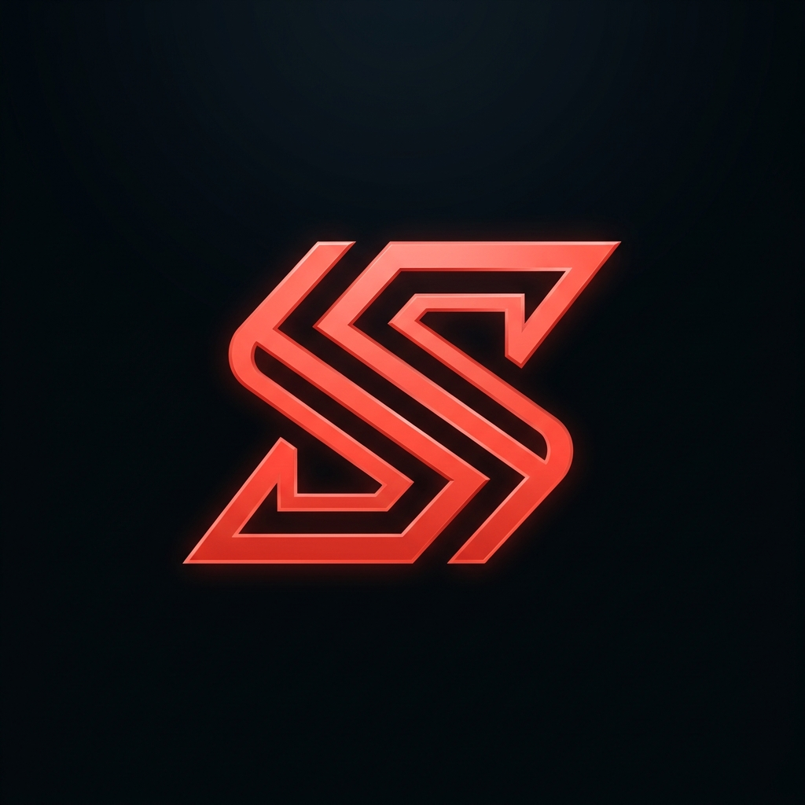

# Samuel Stanley — Full Stack Engineer

A professional, high-performance full-stack web and app developer portfolio built with **Next.js**, **TypeScript**, and **Framer Motion**, featuring a "Deep Space" aesthetic inspired by OpenClaw.ai.



## 🚀 Key Features

- **Deep Space Aesthetic**: Custom starfield background with smooth, high-fidelity CSS animations.
- **Interactive Terminal**: A "Quick Start" terminal component for hiring managers and recruiters to quickly get in touch.
- **Project Showcase**: A structured, high-performance grid featuring major projects like **OPNMRT**, **EMPI Costumes**, and **Study Express UK**.
- **Smooth Scroll-Reveal**: Integrated IntersectionObserver system for premium, staggered animations on scroll.
- **Bilingual Themes**: Fully optimized "Deep Space" (Dark) and "Blueprint" (Light) modes with instant switching.
- **Global Reach**: Designed for remote-first collaboration with multi-timezone support and flexible hiring models.

## 🛠️ Tech Stack

- **Frontend**: Next.js (App Router), React, Tailwind CSS v4-alpha, Framer Motion.
- **Backend**: Node.js, NestJS (in project examples), REST & GraphQL APIs.
- **Database**: PostgreSQL, MongoDB.
- **Infrastructure**: Vercel, Docker, CI/CD with GitHub Actions.
- **Integrations**: Flutterwave, Paystack, Web3Forms, Canvas Confetti.

## 📦 Getting Started

### Prerequisites

- Node.js 18+
- pnpm (recommended) or npm/yarn

### Installation

1. Clone the repository:
   ```bash
   git clone https://github.com/BigT001/samuelstanley.git
   ```

2. Install dependencies:
   ```bash
   pnpm install
   ```

3. Run the development server:
   ```bash
   pnpm dev
   ```

4. Open [http://localhost:3000](http://localhost:3000) with your browser to see the result.

## 🏗️ Production Build

To generate an optimized production build:

```bash
pnpm build
pnpm start
```

## 📬 Get In Touch

Samuel is currently accepting offers for **project-based freelance work**, **remote engineering roles**, and **flexible hybrid positions**.

- **Email**: [info.samuelstanley@gmail.com](mailto:info.samuelstanley@gmail.com)
- **LinkedIn**: [Samuel Stanley](https://www.linkedin.com/in/samuel-stanley-345174234/)
- **Instagram**: [@samuel.g.stanley](https://www.instagram.com/samuel.g.stanley/)

---

© 2026 Samuel Stanley. Built with Next.js, TypeScript & passion.
